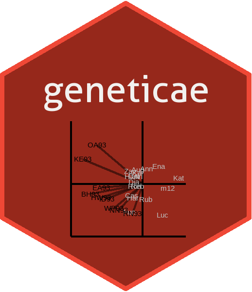

<!-- README.md is generated from README.Rmd. Please edit that file -->

```{r, include = FALSE}
knitr::opts_chunk$set(
  collapse = TRUE,
  comment = "#>",
  fig.path = "man/figures/README-",
  out.width = "45%"
)
```

# geneticae 

## Statistical Tools for the Analysis of Multi Environment Agronomic Trials


Web: <https://jangelini.github.io/geneticae/>

CRAN: <https://cran.r-project.org/web/packages/geneticae/index.html> 


<!-- badges: start -->

<!-- dejo esto porque todavia hay links que no estan disponibles: -->
[](https://lifecycle.r-lib.org/articles/stages.html)

<!-- cuando este en cran agregar estas -->
[](https://CRAN.R-project.org/package=geneticae)
[](https://CRAN.R-project.org/package=geneticae)
<!-- [](https://codecov.io/gh/r-lib/geneticae?branch=master) -->
<!-- badges: end -->

Understanding the relationship between crops performance and environment is a
key problem for plant breeders and geneticists. In advanced stages of breeding
programs, in which few genotypes are evaluated, multi-environmental trials (MET)
are one of the most used experiments. Such studies test a number of genotypes in
multiple environments in order to identify the superior genotypes according to
their performance. In these experimentes, crop performance is modeled as a
function of genotype (G), environment (E) and genotype-environment interaction
(GEI). The presence of GEI generates differential genotypic responses in the
different environments. Therefore appropriate statistical methods should be used
to obtain an adequate GEI analysis, which is essential for plant breeders.

The average performance of genotypes through different environments can only be
considered in the absence of GEI. However, GEI is almost always present and the
comparison of the mean performance between genotypes is not enough. The most
widely used methods to analyze MET data are based on regression models, analysis
of variance (ANOVA) and multivariate techniques. In particular, two statistical
models are widely used among plant breeders as they provide useful graphical
tools for the study of GEI: the Additive Main effects and Multiplicative
Interaction model (AMMI) and the Site Regression Model (SREG). However, these
models are not always efficient enough to analyze MET data structure of plant
breeding programs. They present serious limitations in the presence of atypical
observations and missing values, which occur very frequently. To overcome this,
several imputation alternatives and a robust AMMI were recently proposed in
literature.

Although there are R packages which tackle different aspects of MET data
analysis, there aren't any packages capable of performing all the steps that
need to be considered. The `geneticae` package was created to gather in one
place the most useful functions for this type of analysis and it also implements
new methodology which can be found in recent literature. More importantly,
`geneticae` is the first package to implement the robust AMMI model and new
imputation methods not available before. In addition, there is no need to
preprocess the data to use the `geneticae` package, as it the case of some
previous packages which require a data frame or matrix containing genotype by
environment  means  with  the genotypes in rows and the environments in columns.
In this package, data in long format is required. Genotypes, environments,
repetitions (if any) and phenotypic traits of interest can be presented in any
order and there is no restriction on columns names. Also, extra information that
will not be used in the analysis may be present in the dataset. Finally,
`geneticae` offers a wide variety of options to customize the biplots, which are
part of the graphical output of these methods.

This package can be used through
[this](https://geneticae.shinyapps.io/geneticae-shiny-web-app/) Shiny app, making
it available not only for R programmers.

## Installation

You can install the released version of `geneticae` from [CRAN](https://CRAN.R-project.org) with: 

```{r, eval=F}
install.packages("geneticae")
```

You can install the development version from our [GitHub repo](https://github.com/jangelini/geneticae) with:

``` {r, eval=F}
# install.packages("devtools")
devtools::install_github("jangelini/geneticae")
```

## Shiny app

You can use `geneticae` through
[this](https://geneticae.shinyapps.io/geneticae-shiny-web-app/) Shiny app. Source code is in [GitHub repo](https://github.com/jangelini/Geneticae-Shiny-Web-APP).

## Getting Started

If you are just getting started with `geneticae` we recommend visiting the
vignettes and exploring the examples throughout the package documentation.

Here we present a small example. 

The dataset `yan.winterwheat` has information about the yield of 18 winter wheat
varieties grown in nine environments in Ontario at 1993. The function
`GGEPlot()` builds several GGE biplots views. The basic biplot is produced with
the argument `type="Biplot"`. If the function is used with the argument `type =
"Selected Environment"` and the name of one environment is provided in 
`selectedE`, a line that passes through the environment marker (i.e. OA93), and 
the biplot origin is added. The most suitable cultivars for that particular 
environment can be identified looking at their projection onto this axis. Thus, 
at the environment OA93, the highest-yielding cultivar was _Zav_, and the 
lowest-yielding cultivar was _Luc_. The perpendicular line to the OA93 axis 
separates genotypes that yielded above and below the mean in this environment.

```{r, fig.align='center', fig.cap='Figure: comparison of cultivar performance in a selected environment.'}
library(geneticae)

GGE1 <- GGEmodel(yan.winterwheat, genotype = "gen", environment = "env", 
                 response = "yield", centering = "tester")


GGEPlot(GGE1, type = "Selected Environment", selectedE = "OA93", 
        footnote = F, titles = F)
```

