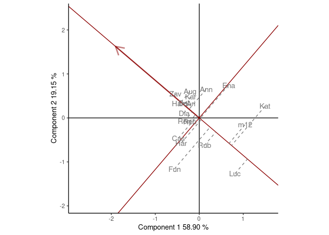

<!-- README.md is generated from README.Rmd. Please edit that file -->

# geneticae 

## Statistical Tools for the Analysis of Multi Environment Agronomic Trials

<!-- cuando este la web poner acá -->
<!-- --- -->
<!-- Web: <https://mpru.github.io/karel/> -->
<!-- CRAN: <https://CRAN.R-project.org/package=karel> -->
<!-- --- -->
<!-- badges: start -->
<!-- dejo esto porque todavia hay links que no estan disponibles: -->

[](https://lifecycle.r-lib.org/articles/stages.html)

<!-- cuando este en cran agregar estas -->
<!-- [](https://CRAN.R-project.org/package=geneticae) -->
<!-- [](https://cran.rstudio.com/package=geneticae) -->
<!-- [](https://codecov.io/gh/r-lib/geneticae?branch=master) -->
<!-- badges: end -->

Understanding the relationship between crops performance and environment
is a key problem for plant breeders and geneticists. In advanced stages
of breeding programs, in which few genotypes are evaluated,
multi-environmental trials (MET) are one of the most used experiments.
Such studies test a number of genotypes in multiple environments in
order to identify the superior genotypes according to their performance.
In these experimentes, crop performance is modeled as a function of
genotype (G), environment (E) and genotype-environment interaction
(GEI). The presence of GEI generates differential genotypic responses in
the different environments (Crossa et al., 1990; Cruz Medina, 1992; Kang
and Magari, 1996). Therefore appropriate statistical methods should be
used to obtain an adequate GEI analysis, which is essential for plant
breeders (Giauffret et al., 2000).

The average performance of genotypes through different environments can
only be considered in the absence of GEI (Yan and Kang, 2003). However,
GEI is almost always present and the comparison of the mean performance
between genotypes is not enough. The most widely used methods to analyze
MET data are based on regression models, analysis of variance (ANOVA)
and multivariate techniques. In particular, two statistical models are
widely used among plant breeders as they provide useful graphical tools
for the study of GEI: the Additive Main effects and Multiplicative
Interaction model (AMMI) (Kempton, 1984; Gauch, 1988) and the Site
Regression Model (SREG) (Cornelius et al., 1996; Gauch and Zobel, 1997).
However, these models are not always efficient enough to analyze MET
data structure of plant breeding programs. They present serious
limitations in the presence of atypical observations and missing values,
which occur very frequently. To overcome this, several imputation
alternatives and a robust AMMI were recently proposed in literature.

Although there are a few R packages which tackle different aspects of
the analysis of MET data, there aren’t any packages capable of
performing all the steps that need to be considered. The `geneticae`
package was created to gather in one place the most useful functions for
this type of analysis and it also implements new methodology which can
be found in recent literature. In addition, there is no need to
preprocess the data to use the `geneticae` package, as it can handle
different dataset formats. Genotypes, environments, repetitions (if any)
and phenotypic traits of interest can be presented in any order and
there is no restriction on columns names, as it is the case with
previous published packages. Also, extra information that will not be
used in the analysis may be present in the datasets. Finally,
`geneticae` offers a wide variety of options to customize the biplots,
which are part of the graphical output of these methods.

This package can be used through a Shiny app, making it available not
only for R programmers. PONER LINK.

## Installation

<!-- poner esto cuando esté en cran -->
<!-- You can install the released version of `geneticae` from -->
<!-- [CRAN](https://CRAN.R-project.org) with: -->
<!-- ``` {r, eval=F} -->
<!-- install.packages("geneticae") -->
<!-- ``` -->

You can install the development version of `geneticae` from
[GitHub](https://github.com/) with:

``` r
# install.packages("devtools")
devtools::install_github("jangelini/geneticae")
```

## Shiny app

You can use `geneticae` through this Shiny app. PONER LINK.

## Getting Started

If you are just getting started with `geneticae` we recommend visiting
the vignettes and exploring the examples throughout the package
documentation.

Here we present a small example: PONDRÍA ALGO MÁS

``` r
library(geneticae)

data(yan.winterwheat)
GGE1 <- GGEmodel(yan.winterwheat)
GGEPlot(GGE1, sizeGen = 5, sizeEnv = 5, footnote=FALSE, title=FALSE)
```


