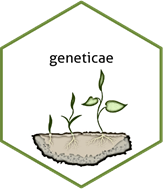
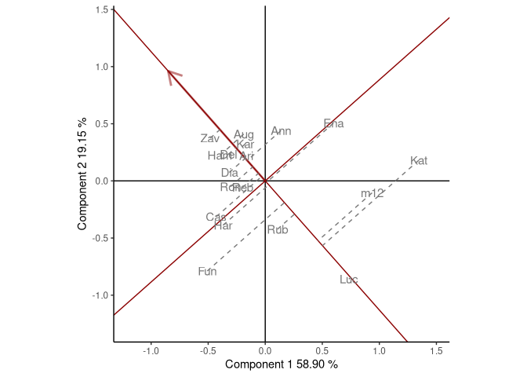

<!-- README.md is generated from README.Rmd. Please edit that file -->

# geneticae 

## Statistical Tools for the Analysis of Multi Environment Agronomic Trials

<!-- cuando este la web poner acá -->
<!-- --- -->
<!-- Web: <https://mpru.github.io/karel/> -->
<!-- CRAN: <https://CRAN.R-project.org/package=karel> -->
<!-- --- -->
<!-- badges: start -->
<!-- dejo esto porque todavia hay links que no estan disponibles: -->

[](https://lifecycle.r-lib.org/articles/stages.html)

<!-- cuando este en cran agregar estas -->
<!-- [](https://CRAN.R-project.org/package=geneticae) -->
<!-- [](https://cran.rstudio.com/package=geneticae) -->
<!-- [](https://codecov.io/gh/r-lib/geneticae?branch=master) -->
<!-- badges: end -->

Understanding the relationship between crops performance and environment
is a key problem for plant breeders and geneticists. In advanced stages
of breeding programs, where few genotypes are evaluated,
multi-environmental trials (MET) is one of the most common experiments.
They are conducted by testing a number of genotypes across multiple
environments, allowing the identification of superior genotypes. Crop
performance is a function of genotype (G), environment (E) and genotype
x environment interaction (GEI). METs are essential due to the presence
of GEI which generates differential genotypic responses in the different
environments evaluated (Crossa et al., 1990; Cruz Medina, 1992; Kang and
Magari, 1996). This is a particular problem for plant breeders
(Giauffret et al., 2000), therefore appropriate statistical methods
should be used to obtain an adequate GEI analysis.

A proper analysis of MET data is essential for the success of a breeding
program. The average performance of genotypes in environments only can
be considered in absence of IGA (Yan and Kang, 2003). However, IGA is
inevitable and genotypes means comparison is not enough, therefore a
more appropriate statistical methodology must be used. The most widely
used to analyze MET data are based on regression models, analysis of
variance (ANOVA) and multivariate analysis techniques. Two
multiplicative models have increased their popularity among plant
breeders as graphic analysis tools for the study of IGA and the analyzes
derived from it: Additive Main effects and Multiplicative Interaction
model (AMMI) (Kempton, 1984; Gauch, 1988) and site regression model
(SREG) (Cornelius et al., 1996; Gauch and Zobel, 1997). However, these
models are not always efficient enough to analyze MET data structure of
plant breeding programs. It has serious limitations in presence of
atypical observations, as well as in front of missing information. Both
phenomena are more a rule rather than an exception when considering real
data. To reduce this handicap, several imputation alternatives and also
an AMMI robust model were proposed recently in literature.

There are numerous packages to analyze MET data but they must be
correctly identified and combined. `geneticae` package is created to
gathers the most useful functions and also offers new ones recently
available in literature. In addition, `geneticae` package is less
restrictive regarding the input dataset format so so there is no need to
preprocess the data to apply the functions. Genotypes, environments,
repetitions (if any) and phenotypic trait of interest can be present in
any order and there is no restriction on columns names. Also, extra
information that will not be used in the analysis may be present in the
dataset. Finally, the biplots created can be customized by the user.

## Getting Started

If you are just getting started with `geneticae` we recommend starting
with the vignettes and exploring the examples throughout the package
*documentation*.

## Installation

You can install the released version of `geneticae` from
[CRAN](https://CRAN.R-project.org) with:

``` r
install.packages("geneticae")
```

And the development version from [GitHub](https://github.com/) with:

``` r
# install.packages("devtools")
devtools::install_github("jangelini/geneticae")
```

## Example

Some quick examples obtained from the `geneticae` package.

``` r
library(geneticae)

data(yan.winterwheat)
GGE1 <- GGEmodel(yan.winterwheat)
GGEPlot(GGE1, sizeGen = 5, sizeEnv = 5, footnote=FALSE, title=FALSE)
```


